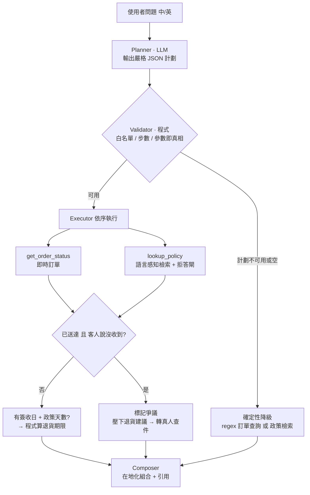
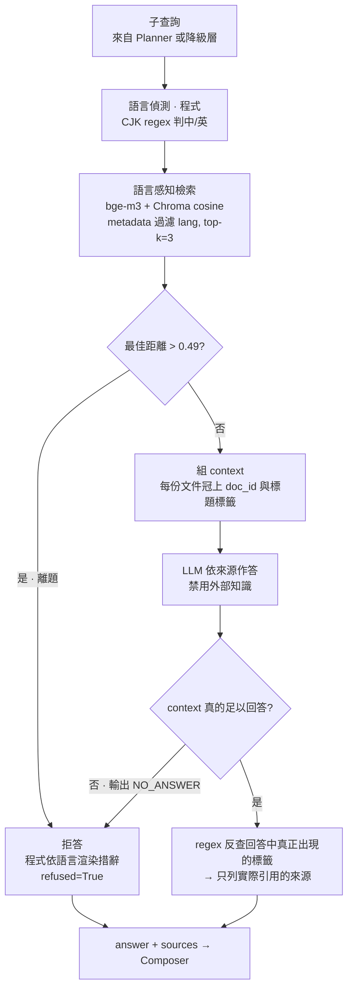

# 跨境電商多語客服 AI 助手：知識庫問答（RAG）＋ 多工具編排 Agent

> 一頁顧問視角案例＋技術說明。示範情境以虛構跨境電商「沐光選物 / MiraLoom」為對象；系統為可實際運行的原型，全部跑在本地開源模型上，**零 API 成本、資料不外流**。
> English version: [CASE_STUDY_EN.md](CASE_STUDY_EN.md)

用中文或英文提問，它從知識庫**依來源作答並附引用**、查不到就**拒答不硬掰**、需要即時資料時**自動編排多個工具**（查訂單＋查政策），而退貨期限這類可稽核的數字則**由程式計算**而非模型口說。

---

## 一、痛點（Why）

跨境電商的客服有三個結構性痛點：

- **重複且多語**：退換貨、運費、付款、會員等政策問題佔大宗，且中英（甚至更多語）都要回，人力重複勞動、跨語一致性難維持。
- **成本與時效**：人工客服在尖峰與非工作時間都是瓶頸；跨時區訂單尤其明顯。
- **答錯的代價高**：客服講錯退貨天數、運費歸屬，直接引發客訴與退款糾紛 —— 這類「答錯比答不出更糟」的風險，是導入 AI 時最需要控制的。

## 二、As-Is → To-Be

| 面向 | As-Is（導入前） | To-Be（導入後） |
|---|---|---|
| 政策 FAQ | 全部進人工，跨語一致性靠個人 | AI 依知識庫作答、**帶來源引用**、多語一致 |
| 答錯風險 | 依賴專員記憶，易出錯 | **檢索不到就拒答、不硬掰**（雙層防護） |
| 即時訂單查詢 | 人工查後台 | Agent 自動呼叫查詢工具 |
| 複合問題（如「還能退嗎＋退款多久」） | 專員逐項查政策再心算日期 | **多工具編排**：查訂單 → 查政策 → 程式算期限，結果可稽核 |
| 送達爭議（系統顯示已送達、客人說沒收到） | 易被當一般退貨處理 | **偵測衝突並轉真人查件**，不給誤導的退貨建議 |
| 非工作時間 | 無人回覆 | 24/7 自動回覆，複雜案件才轉真人 |
| 語言涵蓋 | 受專員語言能力限制 | 中英對稱知識庫，可擴充 |

## 三、系統概觀（What）

系統有兩條主線：**知識庫問答（RAG）** 負責「政策怎麼說」，**多工具編排 Agent** 負責「這張訂單的情況加上政策，答案是什麼」。

貫穿兩者的設計原則是同一句：**判斷交給模型，執行與計算交給程式**。

### 3.1 架構與流程



圖中 `lookup_policy` 只是一個節點，但它內部是一整條 RAG 管線（檢索 → 拒答閘 → 依來源作答 → 引用反查），展開見 §4.2。

順帶一提專案的演進路徑：v1 就是「regex 判斷有無訂單編號 → 查訂單 or 走 RAG」的簡單路由。v2 加入規劃器後，**那條 v1 路由並沒有被丟掉，而是降級成確定性 fallback**（圖中 FB 節點）—— 這也是為什麼 §5.4 的 A 類失敗對使用者影響為零。

### 3.2 技術棧（全本地、開源、$0）

LangChain · **bge-m3** embedding（Ollama）· **Chroma**（cosine, 嵌入式免伺服器）· **Qwen2.5-7B**（Ollama）· Streamlit

---

## 四、知識庫問答（RAG）

### 4.1 檢索與作答管線

這條管線是 `lookup_policy` 工具的內部實作，也是整個系統「不硬掰」的核心。輸入是 Planner 拆出的子查詢（或降級層直接傳入原問題），輸出是「答案＋實際引用到的來源」。



兩道關卡的分工是刻意的：**距離門檻**擋不掉「相關但答案為否」，因為那類問題在向量空間裡離知識庫很近；**提示詞層**才處理它。兩者失敗時都收斂到同一個 `refused` 旗標，Composer 會把 refused 的政策片段整段濾掉，不讓半句沒依據的話流到使用者面前。

### 4.2 設計要點

- **語言感知檢索**：中文問題只回中文來源、英文只回英文（bge-m3 對稱知識庫），保證引用語言一致。語言偵測用一行 CJK regex 而非語言偵測套件 —— 這裡只需要二分類且輸入是使用者原句，上套件是不必要的相依。
- **帶引用作答**：每句答案標出依據的來源標籤，footer 只列**實際被引用**的來源（以 regex 從回答中反查，避免列出檢索到但沒用到的文件）。
- **雙層反幻覺**：
  1. **距離門檻**做粗篩，擋掉離題問題；
  2. **提示詞層**做語意判斷，處理「相關但答案為否」——例如問「可以貨到付款嗎」，知識庫有付款政策（距離很近）但答案是「不提供」，此時據實回否並列出可用方式，而非編造。
- **拒答走 sentinel**：模型只輸出 `NO_ANSWER` 這個決策 token，拒答的措辭由程式依語言渲染 —— 正確性不依賴模型規模，也不會出現模型自己寫的、語氣不一致的道歉句。
- **提示詞注入防禦**：系統提示詞明示忽略使用者問題與檢索內容中試圖覆寫規則的指令（知識庫是可被汙染的輸入面）。

**關鍵洞察**：向量距離衡量的是**主題相關度**，不是**可答性**。這是為什麼單靠門檻不夠、必須加語意層。

### 4.3 結果（68 題黃金測試集，門檻 0.49）

含 21 題離題、14 題「相關但為否」。

| 指標 | 結果 | 意義 |
|---|---|---|
| 檢索命中率 Recall@3 | **100%** | 正確政策文件都被找到 |
| 首位命中 Recall@1 | 91.5% | 保留的真實訊號（見「限制」） |
| **拒答正確率** | **100%** | 該答的答、該拒的拒 —— 客服最關鍵的信任指標 |
| 誤拒率 | 0% | 不會把答得出的問題推走 |
| 離題攔截率 | 100% | 21 題離題全數攔下，含「徵人／員工數／CEO 薪水」等業務相鄰對抗題 |
| 基礎設施成本 | **US$0** | 全本地開源，資料不外流 |

拒答門檻（0.49）以資料校準（非拍腦袋），三類查詢在向量距離上清楚分離：


---

## 五、Agent 多工具編排

### 5.1 架構：判斷交給模型，執行與計算交給程式

只對模型曝露 **兩個工具**：`get_order_status`（即時訂單）與 `lookup_policy`（政策檢索）。

一個刻意的取捨：**退貨期限計算不是工具**。它是執行層的純函式——拿到「簽收日（來自訂單）＋政策天數（來自知識庫 front-matter）」就自動計算，模型碰不到。理由是日期相減沒有任何值得交給模型判斷的地方，把計算機包成工具是常見的過度設計；當成純函式反而最好單元測試。

**多步驟的實例**：「我的訂單 ML240003 還能退嗎？退款要多久？」
→ 查訂單（簽收日）→ 查退貨政策（14 天）→ **程式算出**期限與剩餘天數 → 查退款時程 → 組合並附引用。
回覆中「尚餘 X 天、期限 YYYY-MM-DD」是**算出來的、可稽核的**，不是模型講的。

**送達爭議**：當訂單狀態為「已送達」但客人表示沒收到，系統標記為爭議、**壓下退貨建議**、改為啟動查件並轉真人。對一個說「我根本沒收到」的人回覆「您可以在 7 天內退貨」是誤導 —— 這類判斷寧可保守。

### 5.2 驗證：切開開發集與保留測試集

規劃層不是「跑起來看起來對」就算數，因此比照模型評估的紀律建立兩套題庫：

| 題庫 | 用途 | 規模 |
|---|---|---|
| 開發集 | 除錯、校準、調整提示詞 | 27 題 |
| **保留測試集（held-out）** | **標籤跑前定死、調整期間完全不看，最後只跑一次** | **20 題** |

兩套題庫涵蓋單一工具／多工具／純政策／離題／送達爭議五類，並刻意加入對抗題（口語無標點、中文黏字的訂單編號、業務相鄰的離題問題如「徵人／員工數／CEO 薪水」）。

指標多為確定性、不靠人評：工具選擇正確率、過度規劃率、訂單編號抽取、政策檢索命中、退貨判定正確率、爭議判定正確率。

### 5.3 保留測試集結果

| 指標 | 結果 |
|---|---|
| 工具選擇正確 | **16/20** |
| ・單一工具 / 多工具 / 純政策 / 離題 / 爭議 | 4/4 ・3/4 ・3/5 ・4/4 ・2/3 |
| 訂單編號抽取正確 | 10/11 |
| 政策檢索命中 | 7/9 |
| 退貨判定正確 | 3/4 |
| 爭議判定正確 | 2/3 |
| **過度規劃（不該查訂單卻查了）** | **0** |

測試集分兩批建立：第一批 10 題全數通過；**4 個失敗全部落在後來為了擴大覆蓋而新增的 10 題**——也就是說，新題確實探到了舊題碰不到的失敗模式，這正是擴充測試集的目的。

**開發集不列為報告數字**（它被用來調整過，分數必然樂觀）。它的產出是找出下列失敗模式，不是分數。

### 5.4 三類失敗模式

| 類型 | 現象 | 對使用者的實際影響 |
|---|---|---|
| **A. 規劃器把正當政策問題判成「無需工具」** | 「沐光點會過期嗎」「忘記密碼怎麼重設」被判空計劃 | **無** —— 確定性降級層接住，使用者仍得到正確答案並附引用 |
| **B. 退貨句型會掉訂單查詢步** | 「這件想退，錢會退到哪裡」只查了政策 | 拿得到退款政策，但**少了**該訂單的退貨資格判定 |
| **C. 爭議偵測漏掉換句話說** | 「shows delivered but I got nothing」未觸發爭議流程 | 拿得到訂單狀態，但**未啟動**查件轉真人 |

B 類在開發集與保留測試集**各自獨立出現**（同一失敗模式在兩個集合重現），可判定為可複現的規劃器弱點，不是雜訊。

這張表也帶出一個值得分開衡量的觀點：**規劃器正確率 ≠ 使用者拿到正確答案**。A 類規劃失敗但終端結果正確，正是多層防護生效的證據；真正需要優先處理的是 B、C 這種「終端結果有缺口」的失敗。

---

## 六、商業影響（需以客戶實際資料驗證）

政策 FAQ 與訂單查詢通常佔客服來訊的可觀比例，這部分正是本系統能以「有依據、可稽核」的方式自動處理的範圍。實際的分流率、每張工單成本節省、回應時間改善，應在導入初期用客戶的歷史客服資料建立 baseline 後量測 —— 這是導入的第一步，而非提案時的空頭數字。

## 七、導入判斷亮點

- **量測再決定**：切塊策略是量過中英文件長度分布（英文同語意約中文 3 倍字元）才定，非套預設值；`cosine` 度量也是因為 bge-m3 為 cosine 設計，建 collection 時明確指定 `hnsw:space=cosine`。
- **反幻覺分層**：距離門檻做「粗篩」、提示詞做「語意判斷」，各司其職；洞察到「距離衡量的是主題相關度、不是可答性」。
- **判斷交給模型、措辭與計算交給程式**：拒答措辭、工具回覆、日期計算都由程式處理，正確性不依賴模型規模 —— 小模型不穩的部分用確定性程式兜住。
- **什麼該做成工具、什麼該是普通程式**：只有「需要模型判斷要不要用」的動作才是工具；日期計算不是。
- **多層防護（defense-in-depth）**：驗證器健壯化、regex 參數即真相、確定性注入、檢索拒答閘、組合層過濾 —— 不把正確性押在單一環節。
- **不盲目加技術**：評估顯示純密集檢索已達標，故**未**引入 hybrid/reranker；保留一個真實的檢索精準度訊號，作為「若累積才加」的依據。
- **迭代校準**：測試集從 35 擴到 68 題（重壓離題與業務相鄰對抗題）後，安全間隔收窄、原門檻 0.50 落到邊緣，於是重新置中到 0.49 —— 資料驅動校準的第二輪，也是「小樣本會給過度樂觀數字」的實例。

### 評估方法論上的自我修正

- **擴覆蓋而非衝量**：擴充測試集時不加同義改寫（邊際資訊低），而是加入沒測過的失敗模式（多張訂單、訂單＋離題混合、換貨 vs 退貨、英文爭議）。一題新失敗模式勝過十題改寫。
- **實測到「調提示詞打地鼠」的代價**：為修好某題調整提示詞後，另一題出現迴歸；同一模型、同樣參數，只是提示詞動了幾行。結論是可靠性不能靠在提示詞裡疊規則，要靠確定性層兜住 —— 後續改用程式強制注入必要步驟，就穩定了。

## 八、限制與下一步

**已知限制（皆有評估資料佐證，非推測）：**

- **多張訂單查詢**：一句話同時問兩張訂單時，目前只會回覆第一張。已知修法（改為多筆結構）牽動組合層與爭議判定，評估投入產出後選擇**記錄而非修改**，列入下一版。
- **檢索精準度**：「退貨運費誰出」這類查詢，最對症的政策總覽未進入前三名（使用者仍從其他命中文件得到正確答案）。追查根因是**知識庫本身把退貨運費規則散落在三份文件**——這是知識庫品質問題，不只是檢索問題。
- **規劃器弱點（B 類）**：特定退貨句型會漏掉訂單查詢步，開發集與測試集各自重現。
- **爭議偵測（C 類）**：以關鍵詞判斷「客人說沒收到」，換句話說會漏。正確修法是改用語意判斷，並**另建新測試題**驗證 —— 不能拿現有測試題去補關鍵詞，那會讓保留測試集失效。
- **樣本規模**：測試集 20 題、開發集 27 題屬小樣本。應解讀為「在此規模上未觀察到類化失敗」，而非「準確率百分之百」。
- 知識庫為擬真合成資料；訂單工具為 mock，正式版需接客戶訂單系統 API。

**下一步：** 以客戶真實 FAQ 與客服紀錄擴充題庫並重新校準、合併散落的知識庫規則、修正多訂單與爭議偵測、以客戶資料建立 baseline 後量測分流率與成本、加上人工轉接與滿意度回饋迴路。

---

## 附錄 A：執行方式

```bash
# 1. 安裝 Ollama 後拉模型
ollama pull bge-m3
ollama pull qwen2.5:7b        # 8GB 機器改用 qwen2.5:3b（並改 src/config.py 的 LLM_MODEL）

# 2. 環境
python -m venv .venv && source .venv/bin/activate
pip install -r requirements.txt

# 3. 建索引 → 啟動聊天介面
python src/ingest.py
streamlit run src/app.py

# 4. 評估與繪圖
python src/evaluate.py                            # 知識庫問答：Recall / 拒答 / 門檻掃描
python src/plot_eval.py                           # 距離分布圖
python src/evaluate_agent.py                      # Agent 開發集（27 題，可用於除錯）
python src/evaluate_agent.py data/agent_test.csv  # Agent 保留測試集（20 題，勿用於調整）

# 5. 純函式單元測試（不需 Ollama / Chroma，毫秒級）
pytest
```

## 附錄 B：專案結構

```
rag-cs-kb/
├── data/
│   ├── kb_ecom_cs/          # 知識庫（zh/ 與 en/ 各 38 篇，共 76 檔）
│   ├── gold_set.csv         # 知識庫問答評估集（68 題）
│   ├── agent_gold.csv       # Agent 開發集（27 題）
│   ├── agent_test.csv       # Agent 保留測試集（20 題，held-out）
│   └── glossary.csv         # 中英術語對照
├── src/
│   ├── config.py            # 參數（切塊/top-k/門檻/模型）
│   ├── ingest.py            # 載入 → 切塊 → embedding → Chroma（含政策 front-matter 存入 metadata）
│   ├── retriever.py         # 語言感知檢索 + 拒答門檻
│   ├── generate.py          # 作答 + 引用（雙層反幻覺、NO_ANSWER sentinel）
│   ├── agent.py             # Planner / Validator / Executor / Composer＋兩個工具
│   ├── app.py               # Streamlit 介面
│   ├── evaluate.py          # 知識庫問答評估 harness
│   ├── evaluate_agent.py    # Agent 評估 harness（工具選擇/過度規劃/退貨判定/爭議判定）
│   └── plot_eval.py         # 距離分布圖
├── tests/
│   └── test_agent.py        # 純函式層單元測試（退貨期限/訂單編號抽取/驗證器）
├── pytest.ini
├── reports/threshold_calibration.png
├── AGENT_V2_SPEC.md         # Agent 編排設計規格
├── CASE_STUDY.md            # 本文件（中）
├── CASE_STUDY_EN.md         # 英文版
└── README.md
```
