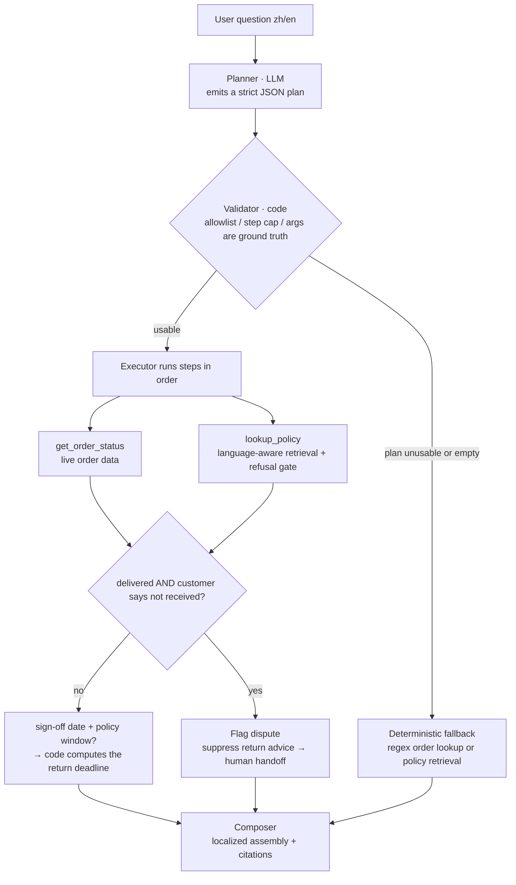
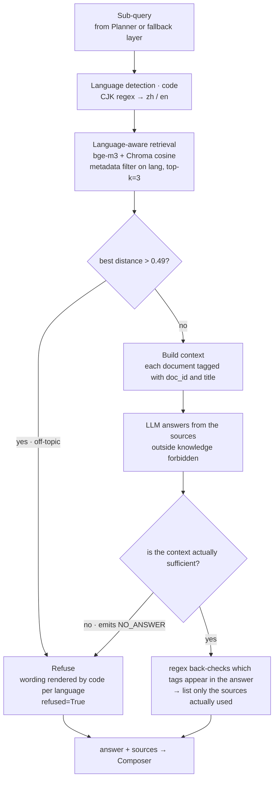
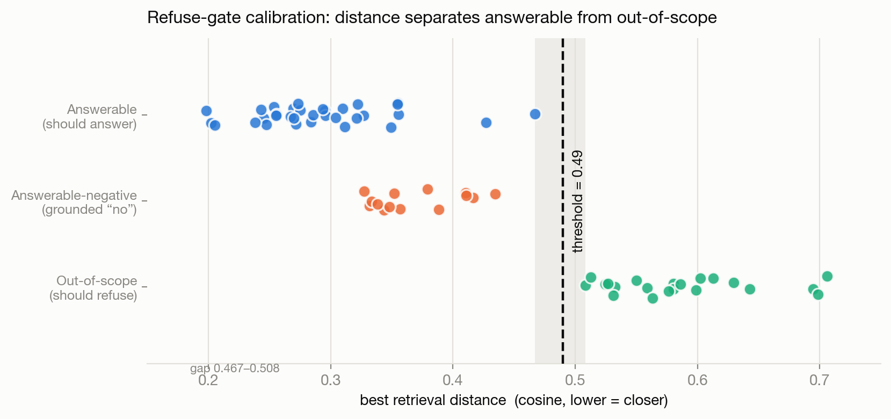

# Multilingual Customer-Support AI for Cross-Border E-Commerce: Knowledge-Base Q&A (RAG) + Multi-Tool Orchestration Agent

> A one-page implementation-consultant view plus the technical detail. The scenario uses a fictional cross-border store, **MiraLoom (沐光選物)**; the system itself is a working prototype that runs entirely on local open-source models — **zero API cost, no data leaving the machine**.
> 中文版：[CASE_STUDY.md](CASE_STUDY.md)

Ask in Chinese or English: it answers **from the knowledge base with source citations**, **refuses rather than fabricates** when it can't retrieve support, and **orchestrates several tools automatically** when live data is needed (order lookup + policy lookup). Auditable numbers such as a return deadline are **computed in code**, not asserted by the model.

---

## 1. The problem (Why)

Customer support at a cross-border store has three structural pain points:

- **Repetitive and multilingual.** Policy questions — returns, shipping, payment, membership — dominate the volume, and each has to be answered in Chinese *and* English (often more). That means duplicated human effort and cross-language inconsistency.
- **Cost and coverage.** Human agents are a bottleneck at peak and after hours — acute for orders across time zones.
- **Wrong answers are expensive.** An agent misstating the return window or who pays return shipping triggers complaints and refund disputes. This "a wrong answer is worse than no answer" risk is the thing that most needs controlling when introducing AI.

## 2. As-Is → To-Be

| Dimension | As-Is | To-Be |
|---|---|---|
| Policy FAQ | All routed to humans; cross-language consistency depends on the individual | AI answers from the knowledge base, **with source citations**, consistent across languages |
| Wrong-answer risk | Relies on agent memory; error-prone | **Refuses when it can't retrieve support — never fabricates** (two-layer guard) |
| Live order status | Human looks it up in the back office | Agent calls a lookup tool automatically |
| Compound questions ("can I still return it *and* how long is the refund?") | Agent checks policy line by line, then works out dates by hand | **Multi-tool orchestration**: order → policy → deadline computed in code, auditable |
| Delivery disputes (system says delivered, customer says not received) | Easily mishandled as an ordinary return | **Detects the conflict, opens an investigation and escalates** — no misleading return advice |
| After hours | No response | 24/7 automated replies; only complex cases go to a human |
| Language coverage | Limited by each agent's languages | Symmetric zh/en knowledge base, extensible |

## 3. System overview (What)

The system has two main lines. **Knowledge-base Q&A (RAG)** answers "what does the policy say"; the **multi-tool orchestration agent** answers "given this order *plus* the policy, what is the answer".

One principle runs through both: **judgment to the model, execution and computation to code.**

### 3.1 Architecture and flow



`lookup_policy` is a single node in this diagram, but internally it is a whole RAG pipeline (retrieval → refusal gate → grounded answering → citation back-check). It is expanded in §4.1.

A note on how the project evolved: v1 was a simple router — "does the text contain an order ID? → order tool, otherwise → RAG". When v2 added the planner, **that v1 router was not thrown away; it was demoted to the deterministic fallback** (node `FB` above). That is precisely why the type-A failures in §5.4 have zero user-visible impact.

### 3.2 Stack (fully local, open source, $0)

LangChain · **bge-m3** embeddings (Ollama) · **Chroma** (cosine, embedded — no server) · **Qwen2.5-7B** (Ollama) · Streamlit

---

## 4. Knowledge-base Q&A (RAG)

### 4.1 The retrieval-and-answer pipeline

This pipeline is the internal implementation of the `lookup_policy` tool, and it is the core of the system's "never fabricate" behaviour. Its input is a sub-query produced by the planner (or the original question, passed straight in by the fallback layer); its output is an answer plus the sources actually cited.



The division of labour between the two gates is deliberate: **the distance gate cannot catch "related, but the answer is no"**, because such questions sit close to the knowledge base in vector space; **the prompt layer** is what handles them. Both failure paths converge on the same `refused` flag, and the composer drops any refused policy segment wholesale — so no unsupported sentence reaches the user.

### 4.2 Design decisions

- **Language-aware retrieval.** Chinese questions retrieve only Chinese sources and English only English (a symmetric bge-m3 knowledge base), guaranteeing the citation language matches the answer. Language detection is one line of CJK regex rather than a detection library — this is a binary decision on the user's own sentence; a dependency would buy nothing.
- **Answers with citations.** Every claim carries the source tag it rests on, and the footer lists only the sources **actually cited** (found by a regex back-check over the answer), not everything retrieval happened to return.
- **Two-layer anti-hallucination.**
  1. **A distance gate** does coarse screening and blocks off-topic questions;
  2. **The prompt layer** does semantic judgment, handling "related but the answer is *no*" — e.g. "Do you take cash on delivery?": the knowledge base has a payment policy (very close in vector space) but the answer is "not offered", so it truthfully says no and lists the methods that *are* available, rather than inventing one.
- **Refusal via a sentinel.** The model only emits the decision token `NO_ANSWER`; the refusal wording is rendered by code per language — correctness doesn't depend on model size, and the user never sees a model-improvised apology in an inconsistent register.
- **Prompt-injection defence.** The system prompt explicitly ignores instructions embedded in the user's question *or in the retrieved context* that try to override its rules — the knowledge base is an attack surface that can be poisoned.

**The key insight:** vector distance measures **topical relevance**, not **answerability**. That is why a threshold alone is not enough and a semantic layer is required.

### 4.3 Results (68-item gold set, threshold 0.49)

Including 21 out-of-scope items and 14 "related but the answer is no".

| Metric | Result | What it means |
|---|---|---|
| Retrieval Recall@3 | **100%** | The correct policy document is always retrieved |
| Recall@1 | 91.5% | A real signal deliberately kept (see Limitations) |
| **Refusal accuracy** | **100%** | Answers what it should, declines what it should — the trust-critical metric for support |
| False-refusal rate | 0% | Never pushes away an answerable question |
| Off-topic catch rate | 100% | All 21 caught, incl. business-adjacent adversarial ones (hiring, headcount, CEO pay) |
| Infrastructure cost | **US$0** | Fully local open-source; data never leaves |

The refusal threshold (0.49) is calibrated from data, not guessed; the three query classes separate cleanly on vector distance:



---

## 5. Agent multi-tool orchestration

### 5.1 Architecture: judgment to the model, execution and computation to code

Only **two tools** are exposed to the model: `get_order_status` (live order data) and `lookup_policy` (policy retrieval).

One deliberate trade-off: **the return-window calculation is not a tool.** It is a pure function in the execution layer — given a sign-off date (from the order) and a policy window (from KB front-matter) it runs automatically, out of the model's reach. Subtracting dates offers nothing worth delegating to a model; wrapping a calculator as a "tool" is a common piece of over-engineering. As a pure function it is also the easiest part to unit-test.

**A real multi-step case:** *"Can I still return order ML240003, and how long does the refund take?"*
→ look up the order (sign-off date) → look up the return policy (14 days) → **code computes** the deadline and days remaining → look up refund timing → compose with citations.
The "X days left, deadline YYYY-MM-DD" in the reply is **computed and auditable**, not asserted by the model.

**Delivery disputes:** when the order status is *delivered* but the customer says it never arrived, the system flags a dispute, **suppresses the return advice**, and opens an investigation with human handoff. Telling someone who never received their parcel that "you may return it within 7 days" is misleading — this class of judgment should stay conservative.

### 5.2 Validation: a development set and a held-out test set

"It looked right when I tried it" is not evidence about a planning layer, so the evaluation follows standard ML discipline with two separate sets:

| Set | Purpose | Size |
|---|---|---|
| Development | Debugging, calibration, prompt iteration | 27 items |
| **Held-out test** | **Labels fixed before running; never inspected during iteration; run exactly once** | **20 items** |

Both cover five categories — single-tool, multi-tool, policy-only, off-topic, delivery dispute — and deliberately include adversarial phrasing: colloquial run-on questions, order IDs glued to Chinese characters, and business-adjacent off-topic questions (hiring, headcount, CEO pay).

Metrics are mostly deterministic and need no human grading: tool-selection accuracy, over-planning rate, order-ID extraction, policy-retrieval hit, return-eligibility correctness, dispute-detection correctness.

### 5.3 Held-out results

| Metric | Result |
|---|---|
| Tool selection correct | **16/20** |
| ・single / multi / policy-only / off-topic / dispute | 4/4 ・3/4 ・3/5 ・4/4 ・2/3 |
| Order-ID extraction correct | 10/11 |
| Policy-retrieval hit | 7/9 |
| Return-eligibility correct | 3/4 |
| Dispute detection correct | 2/3 |
| **Over-planning (called the order tool when it shouldn't)** | **0** |

The test set was built in two rounds: all 10 items of the first round pass, and **all four failures fall in the 10 items added later to widen coverage** — that is, the new items genuinely probed failure modes the original ones could not reach, which is exactly what growing a test set is for.

**Development-set scores are not reported here.** That set was iterated against, so its numbers are optimistic by construction; its output is the failure modes below, not a score.

### 5.4 Three failure modes

| Type | Symptom | Actual impact on the user |
|---|---|---|
| **A. Planner rules a legitimate policy question "no tool needed"** | "Do loyalty points expire?", "How do I reset my password?" returned an empty plan | **None** — the deterministic fallback catches it; the user still gets the correct, cited answer |
| **B. Return phrasings drop the order-lookup step** | "I want to return this one, where does the money go?" only queried policy | Refund policy is delivered, but the **eligibility check for that order is missing** |
| **C. Dispute detection misses paraphrases** | "shows delivered but I got nothing" did not trigger the dispute flow | Order status is delivered, but the **investigation/handoff never starts** |

Type B appeared **independently in both the development and the held-out set** — the same failure mode reproducing across two separate sets makes it a genuine planner weakness rather than noise.

The table also surfaces a distinction worth measuring separately: **planner accuracy ≠ the user getting a correct answer.** Type A is a planning failure with a correct end result — evidence that the layered guards work. What actually needs fixing first is B and C, where the end result has a gap.

---

## 6. Business impact (to be validated on the client's own data)

Policy FAQs and order-status lookups typically make up a meaningful share of inbound tickets, and that share is exactly what this system can handle in a grounded, auditable way. The actual deflection rate, cost-per-ticket savings, and response-time improvement should be measured after establishing a baseline from the client's historical support logs — that is the first step of an engagement, not a number to put in a pitch.

## 7. Implementation judgment

- **Measure before deciding.** The chunking strategy was set after measuring the length distribution of the Chinese vs. English documents (English runs ~3× the characters for the same meaning), not by copying a default; `cosine` was chosen because bge-m3 is built for it, and the collection is created with an explicit `hnsw:space=cosine`.
- **Layered anti-hallucination.** The distance gate does coarse screening; the prompt does semantic judgment — each doing its own job — grounded in the insight that *distance measures topical relevance, not answerability*.
- **Judgment to the model, wording and execution to code.** Refusal wording, tool replies and date arithmetic are all handled deterministically, so correctness doesn't depend on model size — the parts a small model is unreliable at are handled by code.
- **What deserves to be a tool, and what is just a function.** Only the two actions where the model genuinely has to decide *whether to use them* are tools; date arithmetic is not.
- **Defense in depth.** A hardened validator, regex-derived arguments as ground truth, deterministic step injection, the retrieval refusal gate, composer-level filtering — correctness is never staked on a single link in the chain.
- **No cargo-culting techniques.** Evaluation showed dense retrieval already met the bar, so hybrid/reranker was **not** added; one genuine retrieval-precision signal is kept as the trigger for adding it *only if such cases accumulate*.
- **Iterative calibration.** Growing the eval set from 35 to 68 (weighted toward off-topic and business-adjacent adversarial cases) narrowed the observed safe margin and left the original 0.50 threshold at the edge, so I re-centered it to 0.49 — a live example of how a small sample yields over-optimistic numbers.

### Self-corrections in evaluation methodology

- **Widen coverage, not volume.** Growing the test set meant adding untested failure modes (two order IDs in one sentence, order + off-topic mixed, exchange vs. return, English disputes) rather than paraphrases. One new failure mode is worth ten rewordings.
- **Measured the cost of "prompt whack-a-mole."** Tweaking the prompt to fix one item caused a regression in another — same model, same parameters, a few lines of prompt. The conclusion: reliability comes from deterministic layers, not from stacking rules in a prompt. Switching to a code-level forced step made the behaviour stable.

## 8. Limitations & next steps

**Known limitations (all evidenced, not speculative):**

- **Multiple order IDs in one question.** Only the first order is answered. The fix (multi-order structures) ripples into the composer and dispute logic; after weighing the cost it was **recorded rather than fixed**, and deferred to the next version.
- **Retrieval precision.** For "who pays return shipping", the most on-point policy overview does not make the top 3 (the user still gets a correct answer from another retrieved document). Root cause: **the knowledge base itself spreads the return-shipping rule across three documents** — a KB quality issue, not only a retrieval one.
- **Planner weakness (type B).** Certain return phrasings drop the order-lookup step, reproduced independently in both sets.
- **Dispute detection (type C).** It keys on phrases for "I didn't receive it", so paraphrases slip through. The correct fix is semantic classification validated on **newly written test items** — patching the keyword list using the existing test items would invalidate the held-out set.
- **Sample size.** 20 held-out and 27 development items are small. Read them as "no generalisation failure observed at this scale", not as a claim of perfect accuracy.
- The knowledge base is realistic synthetic data; the order tool is a mock — a production version connects to the client's order-system API.

**Next:** expand and re-calibrate on the client's real FAQs and support logs, consolidate the scattered KB rules, fix multi-order handling and dispute detection, establish a baseline from client data before measuring deflection and cost, and add human handoff plus a satisfaction feedback loop.

---

## Appendix A: Running it

```bash
# 1. Install Ollama, then pull the models
ollama pull bge-m3
ollama pull qwen2.5:7b        # on an 8GB machine use qwen2.5:3b (and change LLM_MODEL in src/config.py)

# 2. Environment
python -m venv .venv && source .venv/bin/activate
pip install -r requirements.txt

# 3. Build the index → launch the chat UI
python src/ingest.py
streamlit run src/app.py

# 4. Evaluation and plots
python src/evaluate.py                            # KB Q&A: recall / refusal / threshold sweep
python src/plot_eval.py                           # distance distribution plot
python src/evaluate_agent.py                      # Agent development set (27 items, for debugging)
python src/evaluate_agent.py data/agent_test.csv  # Agent held-out set (20 items, never tune on this)

# 5. Pure-function unit tests (no Ollama / Chroma needed, milliseconds)
pytest
```

## Appendix B: Project structure

```
rag-cs-kb/
├── data/
│   ├── kb_ecom_cs/          # Knowledge base (38 docs each in zh/ and en/, 76 files)
│   ├── gold_set.csv         # KB Q&A eval set (68 items)
│   ├── agent_gold.csv       # Agent development set (27 items)
│   ├── agent_test.csv       # Agent held-out test set (20 items)
│   └── glossary.csv         # zh-en terminology
├── src/
│   ├── config.py            # Parameters (chunking / top-k / threshold / models)
│   ├── ingest.py            # Load → chunk → embed → Chroma (policy front-matter into metadata)
│   ├── retriever.py         # Language-aware retrieval + refusal gate
│   ├── generate.py          # Grounded answering + citations (two-layer guard, NO_ANSWER sentinel)
│   ├── agent.py             # Planner / Validator / Executor / Composer + two tools
│   ├── app.py               # Streamlit UI
│   ├── evaluate.py          # KB Q&A evaluation harness
│   ├── evaluate_agent.py    # Agent evaluation harness (tool selection / over-planning / eligibility / dispute)
│   └── plot_eval.py         # Distance distribution plot
├── tests/
│   └── test_agent.py        # Pure-function unit tests (return window / order-ID / validator)
├── pytest.ini
├── reports/threshold_calibration.png
├── AGENT_V2_SPEC.md         # Agent orchestration design spec
├── CASE_STUDY.md            # Chinese version
├── CASE_STUDY_EN.md         # This document
└── README.md
```
