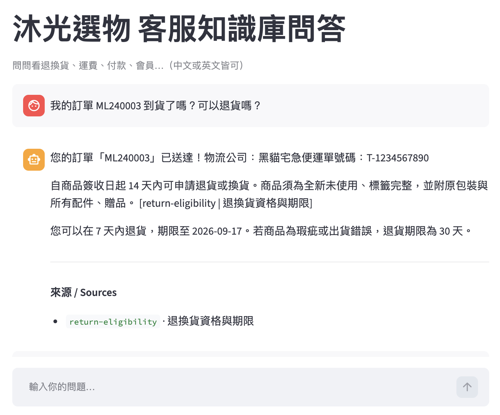

# 多語客服知識庫 RAG ＋ 多工具編排 Agent

跨境電商客服 AI 助手。中英文提問皆可：**依知識庫作答並附引用**、查不到就**拒答不硬掰**、需要即時資料時**自動編排多個工具**（查訂單＋查政策），退貨期限這類可稽核的數字**由程式計算**而非模型口說。全部跑在本地開源模型，**零 API 成本、資料不外流**。

- **語言感知檢索**：中文問題只回中文來源、英文只回英文（bge-m3 對稱知識庫）。
- **雙層反幻覺**：距離門檻擋離題 ＋ 提示詞層處理「相關但答案為否」。拒答措辭由程式渲染。
- **多工具編排**：Planner（LLM 出 JSON 計劃）→ Validator（白名單／參數即真相）→ Executor → Composer。
- **多層防護**：規劃器失手時由驗證器、確定性降級、檢索拒答閘接住 —— 正確性不押在單一環節。
- **可驗證**：開發集／保留測試集分離；純函式層有不需模型即可執行的單元測試（`pytest`）。

一句話同時觸發訂單查詢與政策檢索；回覆中的「尚餘 X 天、期限 YYYY-MM-DD」是程式用「簽收日 ＋ 知識庫政策天數」算出來的，不是模型生成的，因此可稽核：



| 知識庫問答（68 題黃金集） | | Agent 編排（20 題保留測試集） | |
|---|---|---|---|
| 拒答正確率 | **100%** | 工具選擇正確 | **16/20** |
| 檢索 Recall@3 | 100% | 過度規劃 | **0** |
| 離題攔截率 | 100% | 訂單編號抽取 | 10/11 |
| 誤拒率 | 0% | 基礎設施成本 | **US$0** |

> 保留測試集標籤跑前定死、只跑一次；開發集分數不列為結果（它被調整過，數字必然樂觀）。

拒答門檻（0.49）以資料校準，三類查詢在向量距離上清楚分離：


**完整說明 → [CASE_STUDY.md](CASE_STUDY.md)**（架構圖、評估方法論、三類失敗模式、誠實限制）· English → **[CASE_STUDY_EN.md](CASE_STUDY_EN.md)**

```bash
ollama pull bge-m3 && ollama pull qwen2.5:7b
pip install -r requirements.txt
python src/ingest.py && streamlit run src/app.py   # 評估與測試指令見 CASE_STUDY 附錄 A
```

<sub>示範情境為虛構跨境電商「沐光選物 / MiraLoom」，知識庫為擬真合成資料、訂單工具為 mock。</sub>
